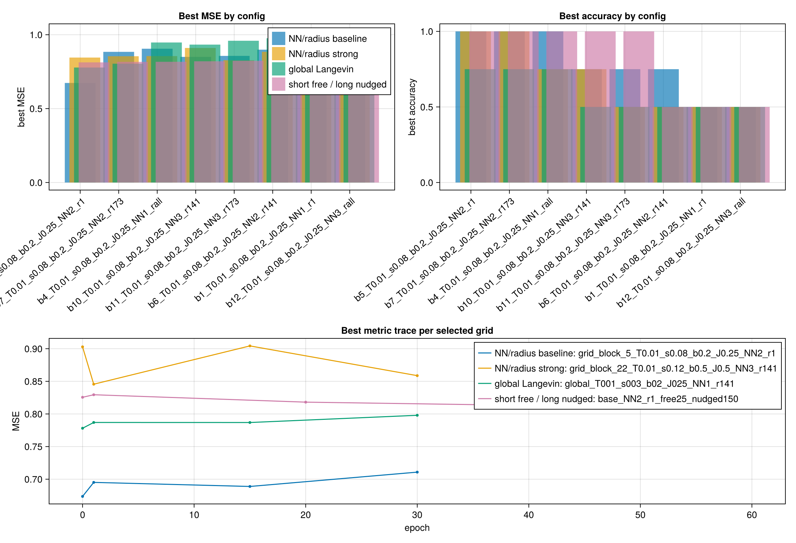

# Local Checkerboard Failed Run Archive

Generated: 2026-05-11 01:05

This archive replaces the full generated run folders for local-checkerboard XOR probes that did not reach the useful target (`MSE < 0.5`). The source experiment files are untouched. Runs with best recorded MSE below `0.5` were left on disk for now; runs above `0.5`, aborted grids, and empty smoke folders were removed after this archive was written.

## Compact Comparison

## Main Takeaways

- Direct output-pattern clamping was necessary, but not sufficient.
- Static double-well potentials did not fix the weak-output failure mode.
- Same-layer `internal_nn` and inter-layer `inter_radius` both matter; the best short screen was `internal_nn = 2`, `inter_radius = 1.01`, `T = 0.01`, `stepsize = 0.08`, `beta = 0.2`, `J = 0.25`, with best MSE about `0.67`, but it did not survive averaging.
- Stronger coupling/clamping and unadjusted GlobalLangevin did not immediately improve the result.
- Short free / longer nudged relaxation slightly helped in cheap screens, but focused `50/300` relaxation still stayed around MSE `0.92`.
- Saved trained graphs checked during this sequence preserved adjacency symmetry; keep this as an acceptance check.

## Best Recorded Runs Before Cleanup

| Run | Config | Best MSE | Best Acc | Final MSE | Final Acc |
|---|---|---:|---:|---:|---:|
| `metropolis_2x2_symmetric_nodecay_20260509_213406` | `checker_2x2_global` | 0.184 | 1.0 | 0.184 | 1.0 |
| `metropolis_2x2_sym_lazy_T0010_inter010_20260510_000037` | `checker_2x2_global` | 0.245 | 1.0 | 0.357 | 1.0 |
| `metropolis_2x2_sym_lazy_stronger_20260509_234023` | `checker_2x2_global` | 0.26 | 1.0 | 0.605 | 0.75 |
| `metropolis_2x2_sym_lazy_seed5_T0010_inter010_20260510_001506` | `checker_2x2_global` | 0.267 | 1.0 | 0.386 | 1.0 |
| `metropolis_2x2_sym_lazy_inter012_20260509_234343` | `checker_2x2_global` | 0.33 | 1.0 | 0.366 | 1.0 |
| `metropolis_2x2_sym_lazy_seed4_T0010_inter010_20260510_001217` | `checker_2x2_global` | 0.359 | 1.0 | 0.508 | 1.0 |
| `metropolis_2x2_sym_lazy_seed1_T0010_inter010_20260510_000409` | `checker_2x2_global` | 0.37 | 1.0 | 0.379 | 1.0 |
| `metropolis_2x2_sym_lazy_seed2_T0010_inter010_20260510_000651` | `checker_2x2_global` | 0.483 | 1.0 | 0.483 | 1.0 |
| `metropolis_2x2_sym_lazy_T0005_inter008_20260509_235213` | `checker_2x2_global` | 0.487 | 1.0 | 0.548 | 1.0 |
| `metropolis_2x2_sym_lazy_T0005_inter010_20260509_235749` | `checker_2x2_global` | 0.512 | 0.75 | 0.594 | 0.75 |
| `metropolis_2x2_sym_lazy_T0015_beta02_20260509_233638` | `checker_2x2_global` | 0.549 | 0.75 | 0.592 | 0.75 |
| `metropolis_2x2_sym_lazy_T0008_inter008_20260509_235502` | `checker_2x2_global` | 0.572 | 0.75 | 0.725 | 0.75 |
| `grid_screen_continuous_nodw_pattern_20260510_204557` | `grid_block_5_T0.01_s0.08_b0.2_J0.25` | 0.65 | 1.0 | 0.66 | 1.0 |
| `grid_strongJ_nodw_pattern_20260510_210918` | `strongJ_3_T0.02_s0.08_b0.2_J0.5` | 0.673 | 0.75 | 0.673 | 0.75 |
| `grid_NN_radius_fast_20260510_214619` | `grid_block_5_T0.01_s0.08_b0.2_J0.25_NN2_r1` | 0.674 | 1.0 | 0.711 | 1.0 |
| `grid_global_NN_radius_fast_20260510_222130` | `global_T001_s003_b02_J025_NN1_r141` | 0.778 | 0.75 | 0.798 | 0.75 |
| `best_screen_longer_seedmatched_nodw_pattern_20260510_210233` | `checker_2x2_global` | 0.81 | 1.0 | 0.838 | 0.75 |
| `grid_free_short_nudged_long_20260511_002252` | `base_NN2_r1_free25_nudged150` | 0.813 | 1.0 | 0.814 | 0.75 |

Full compact table: `local_checkerboard_failed_run_archive.csv`.

## Cleanup Policy

- Removed: generated local-checkerboard run directories with best MSE above `0.5`.
- Removed: aborted/no-summary folders from interrupted grid probes.
- Kept: generated local-checkerboard run directories with best MSE below `0.5`, because they may still be useful as reference points.
- Kept: `_summary/`, containing this markdown file, the compact CSV table, and the comparison PNG.
